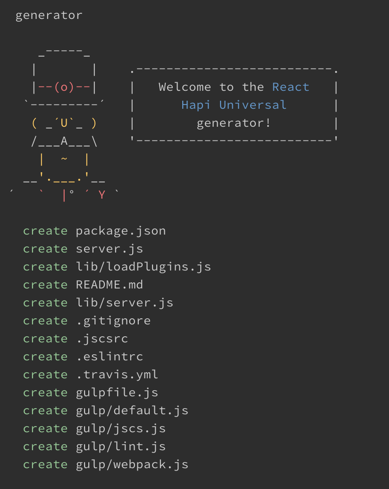
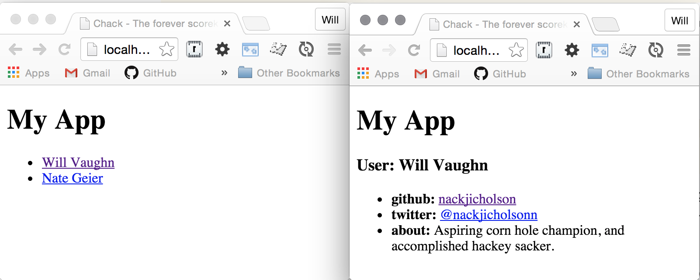

# generator-react-hapi-universal

> Scaffold a Universal JavaScript app
> using [React](https://facebook.github.io/react/), [hapijs](http://hapijs.com/), and [react-router](https://github.com/rackt/react-router)



## Install

```
$ npm install -g generator-react-hapi-universal
```


## Usage

With [yo](https://github.com/yeoman/yo):

```
$ yo react-hapi-universal
```

## Generator Features

#### Universal JavaScript Sample App

This project utilizes hapijs and react-router to serve a universal javascript application. The app consists
of the following very simple routes which render both on the server and client. You might also have heard
this technique referred to as "Isomorphic JavaScript".

"/" UsersIndex

Shows a list of two "users" loaded from a hardcoded set of data from `./lib/app/users.js`.

"/:id" UserProfile

Shows the profile of the user with the given `id` param.



To run the app:

1. `npm start`
2. visit [localhost:8000](http://localhost:8000)

#### Webpack Dev Server with Hot Module Loading

Hot module loading allows you to live edit your app and see the changes reflected in the browser in
near real time. You should use this mode while you're developing your app to maximize your speed of iteration.

To run the webpack dev server:

1. `npm run dev`
2. visit [localhost:8080](http://localhost:8080)
3. Start coding.

#### Webpack Production Build

After you've made your changes, you can run a production build to update your `bundle.js` client side app.

`gulp build` Builds a production distribute at `lib/public/js/dist/bundle.js`.

#### Linting and Code Style with Gulp + JSCS + ESLint

Defaults to using the "airbnb" ESLint and JSCS presets for ES6 and React linting, but you can set it
to whatever you would like. For more information about the airbnb javascript lint
settings see [airbnb javascript](https://github.com/airbnb/javascript).

`gulp lint` to lint your code once.  
`gulp lint-dev` to set up a file watcher to lint on every file save.
`gulp jscs` to run the jscs code style checks.


## Tip

Use [chalk](https://github.com/sindresorhus/chalk) if you want colors in your CLI.
